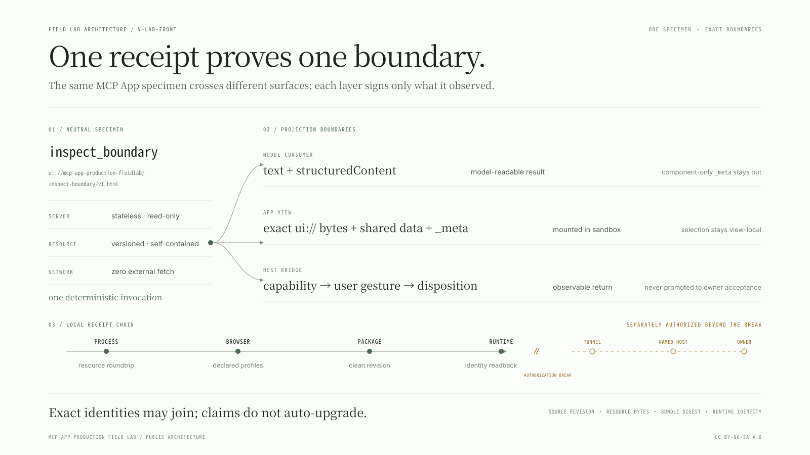
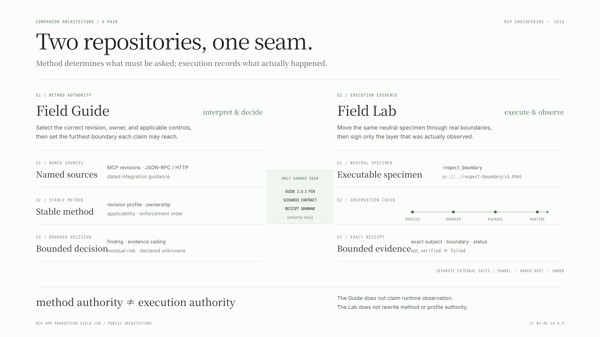
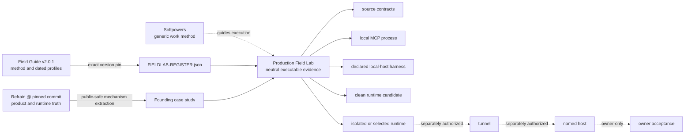
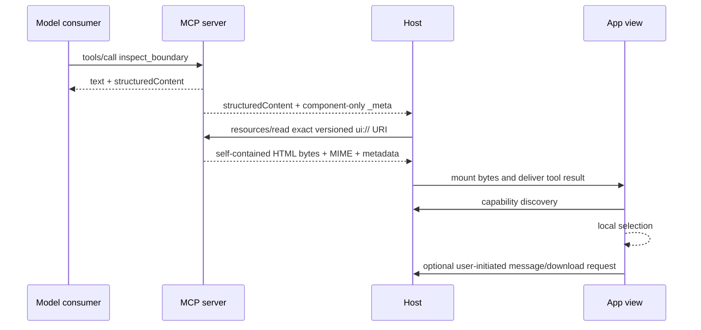

<!-- docs-pair: architecture; locale: en; mirror: docs/ARCHITECTURE.md -->

# Architecture

[简体中文](./ARCHITECTURE.md)

MCP App Production Field Lab does not introduce another framework. Its core job is to place authority, execution surfaces, and evidence ceilings in one explicit topology. The neutral specimen is realistic enough to exercise MCP resources, the App bridge, a browser sandbox, and package/runtime paths, yet small enough to keep Refrain product logic outside the repository. MCP Server Engineering Field Guide `2.0.1` remains the method authority.



## Authority topology





The arrows do not transfer authority:

- The Field Guide owns method/profile interpretation; the Lab owns executions against an exact selected profile set.
- Softpowers owns general implementation/debugging/verification workflow; the Lab supplies MCP App-specific seams and receipts.
- Refrain owns its source, renderer, deployment, runtime, and acceptance truth; the case study extracts mechanisms only.
- A local harness owns only its declared observable envelope. It cannot speak for ChatGPT or another named host, host account policy, discovery cache, or undocumented behavior.

## Dual-consumer specimen

One `inspect_boundary` invocation serves two consumers without merging their data boundaries:



The server is stateless and read-only. Selection state stays in the view. Capability discovery begins as `pending`; only completion may produce `available`, `missing`, or a failure state. Optional host actions appear only after a capability becomes available, and an in-flight request is disabled with an exposed busy state. A bridge return is recorded only as the disposition supported by its actual contract. It is neither owner acceptance nor a basis for inventing a host-side cause.

## Exact resource boundary

Production resource authority is one explicit-version URI:

```text
ui://mcp-app-production-fieldlab/inspect-boundary/v1.html
```

The production builder emits JS/CSS artifacts. `src/self-contained-view.ts` reads the exact manifest-entry closure, rejects static `imports`, `dynamicImports`, additional chunk dependencies, and unsafe absolute/traversal paths, escapes closing tags, and assembles one HTML document with inline style and module script. The MCP server registers and serves those exact bytes with `text/html;profile=mcp-app` and a zero-domain CSP.

This contract exists because MCP JSON-RPC/resource delivery and iframe asset GETs are different planes. A resource may be discoverable while external scripts, styles, fonts, or media remain unreachable. The local MCP smoke must therefore perform `resources/read`, and the browser harness must mount the returned bytes. Unexpected network is evidence of a contract violation.

## Version and identity graph

Server metadata and runtime candidates read the version authority from the packaged `package.json`; the register validator binds it to `FIELDLAB-REGISTER.json`. The Lab does not make one hash stand for every identity:

| Identity                       | Question                                                                |
| ------------------------------ | ----------------------------------------------------------------------- |
| package/register version       | Which unreleased Field Lab contract version is declared?                |
| `source_revision`              | Which exact committed source tree was selected?                         |
| resource URI                   | Which versioned MCP App document name was requested?                    |
| resource `sha256` + byte count | Which exact HTML bytes were read and mounted?                           |
| per-file SHA-256               | Which exact files are in the runtime candidate?                         |
| `bundle_digest`                | Which sorted candidate payload identity was packaged?                   |
| runtime health identity        | Which source revision/bundle does this process report serving?          |
| image/service identity         | Which immutable operator artifact was selected, if a deployment exists? |

Resource content identity is not source identity. Package identity is not activated-runtime identity. A health response is meaningful only when it comes from the same origin/process serving the MCP endpoint under test.

## Evidence policy and receipt model

`src/evidence/policy.ts` is the single declarative authority for boundary, exercise surface, environment class, method rung, authorization/runner, and subject-identity requirements. `validateScenarioSet` checks exact `id@revision` uniqueness, prerequisite existence, an acyclic graph, ceiling monotonicity, and legal runner combinations. Beyond the structural schema, `parseReceiptAgainstScenario` checks a receipt against its exact scenario so that environment, rung, status, and subject identity cannot exceed the contract.

Scenario contracts live under `scenarios/`; structural receipt authority lives in `src/evidence/receipt.ts` and its generated JSON Schema. Every receipt records:

- exact scenario id/revision and claim text;
- `verified`, `failed`, or `not_verified`;
- one `method_rung` and an explicit `proof_ceiling`;
- subject identities actually used for the decision;
- environment/profile and separately modeled capability discovery/disposition;
- optional `confirmed`, `probable`, or `unknown` root-cause confidence;
- observations, evidence references, limitations, and non-empty `not_proven`.

Attempted `verified` or `failed` receipts require actual observations and evidence references, plus resource/artifact/runtime identity where the rung requires it. A `verified` receipt must also have a `method_rung` that exactly reaches the claim rung declared by its scenario (currently expressed by its `proof_ceiling`); an observation below that rung cannot be recorded as the verified exact claim. `not_verified` requires an exact `not_verified_reason` but must not fabricate an external identity that does not exist yet. An available capability and a rejected request can coexist with a verified process observation; they are different dimensions.

## Local receipt chain

Ordinary local verification now produces a live but still local-only four-receipt chain:

1. `npm run check` ends by running `test:mcp` and writes `tmp/receipts/mcp-resource-roundtrip.json`.
2. `npm run test:host` uses `scripts/run-host-evidence.ts` to launch Playwright with its JSON reporter. The runner accepts only the exact five-test closure: all five required titles/results pass exactly once, with zero skipped, unexpected, flaky, or report errors. It writes `tmp/receipts/mcp-host-profile-matrix.json` only after that complete attestation and the resource prerequisite set validate. There is no standalone successful writer path outside this evidence runner.
3. `npm run package:runtime` requires both receipts to come from the same clean committed revision. It uses the staged candidate's own complete `scenarios/` set and compiled validators to validate the prerequisite receipt set, then atomically adopts the candidate and writes `tmp/receipts/package.clean-revision@1.json`.
4. `npm run smoke:runtime` reads the resource, host, and package receipts and uses the candidate runtime's own `scenarios/` and compiled policy to validate the four-receipt chain after adding the runtime receipt. It persists `tmp/receipts/runtime.isolated-readback@1.json` only after the child has stopped and the temporary runtime projection has been cleaned up successfully.

For every attempted dependent receipt, the validator collects the complete transitive prerequisite closure, requires every receipt in it to exist with status `verified`, and compares each ancestor with the dependent. Join fields are `source_revision`, exact `resource`, `bundle_digest`, and `runtime_identity`; a given ancestor/dependent pair compares each field carried by both. Exact resource identity comprises URI, MIME, bytes, and SHA-256. Every attempted receipt carrying a resource must also include a `resource:sha256:<subject.resource.sha256>` evidence reference. The current graph therefore compares package with its resource/host ancestors by clean source revision. Runtime is compared not only with package by source revision plus bundle digest, but also with the transitive resource/host ancestors by source revision plus exact resource. The runtime resource remains constrained by both process receipts even though the package receipt omits resource.

These receipts, candidates, browser traces, and screenshots remain in ignored/local-only paths. The public CI `clean-package-runtime` job must rerun `npm run check` and `npm run test:host` in the same clean checkout/job before package/smoke; raw receipts are neither uploaded nor shared across jobs or runs.

## Local host harness

The harness uses the MCP Apps bridge and a real iframe lifecycle under three explicit profiles:

- `restricted`: sandbox only; message/download capability is absent.
- `capability-success`: message and download are advertised and return successfully.
- `capability-rejected`: the same capabilities are advertised; download is explicitly rejected, while message is recorded only as returned/failed to match what the bridge exposes.

The ledger records resource URI/MIME/bytes, initialization sequence, protocol requests, capability pending-to-terminal transitions, request dispositions, console/page errors, and unexpected network. It sets `namedHostSimulation: false` by contract. Checks at 320px/390px and by keyboard keep identities, fallback content, and actions from being clipped. A green local harness proves only that the exact App behaves under these declared envelopes; it never proves ChatGPT admission, cache refresh, workspace policy, tunnel state, or owner acceptance.

The host receipt is not inferred directly from “Playwright exited 0.” `run-host-evidence.ts` consumes the exact JSON report closure and requires `expected=5`, `skipped=0`, `unexpected=0`, `flaky=0`, report `errors=[]`, and an exact match for all five canonical test titles, expected/pass status, and one passed result each. Any extra, missing, duplicate, skipped, flaky, or unexpected result prevents receipt emission.

## Package and activation boundary

The package lane deliberately follows source/process tests:

1. Generate the resource and host prerequisite receipts on a clean committed checkout.
2. Refuse dirty source and an already-existing output path, then resolve that committed revision.
3. Build in a detached clean worktree with the pinned lockfile.
4. Materialize the runtime-only candidate, full scenario authority, complete layered-license boundary, and sorted per-file identities.
5. Semantically validate the candidate-owned scenario set and prerequisite receipt set, produce the package receipt, record `release.json`, and atomically adopt the candidate path.
6. Copy the candidate into an isolated temporary projection, install production dependencies, start a fresh loopback process, compare `/healthz` identity with MCP discovery/tool/resource readback, and validate the four-receipt chain. Persist the runtime receipt only after both child stop and temporary-projection cleanup succeed.

That isolated process can prove the candidate executes and self-reports consistently. It does not prove that an operator installed or selected it as production, or that a tunnel or named host reaches it.

## Documentation and public CI witness

`DOCS-REGISTER.json` registers Chinese-default and English-mirror pairs, reciprocal switches, and shared facts that must stay synchronized. `scripts/validate-docs.mjs` checks only structure and registered facts; it does not claim semantic equivalence for prose. `LICENSE` and `LICENSE-DOCUMENTATION.md` remain governing singletons. `LICENSING.md` is the governing English path map, while the Chinese version is for reading convenience only.

`.github/workflows/verify.yml` is credential-free, read-only public witness source. It can replay source/process, browser-host, clean-package, and isolated-runtime lanes. A workflow file existing is not evidence that a remote run completed; remote CI execution remains `not_verified` until GitHub Actions actually runs it.

The two bilingual native-SVG pairs in `docs/architecture/` are the README and architecture front doors. Each SVG is both editable source and publication artifact. It must remain self-contained, with no script, `foreignObject`, external font, image, stylesheet, or remote fetch. English and Chinese siblings share geometry, stable group IDs, and boundary semantics while keeping natural language copy. A semantic change requires both language files to change together and real-browser inspection at 1600×900 and README width; XML validity does not substitute for legibility review.

## Trust and side-effect boundaries

Ordinary local actions include source inspection, build/test, bundled Chromium execution, ignored receipt generation, clean candidate packaging, and isolated loopback smoke. These remain separate gates:

- credential/profile access and tunnel preflight;
- starting or restarting a tunnel/service;
- selecting or deploying an immutable runtime;
- authenticated named-host discovery or interaction;
- recording owner acceptance;
- remote/visibility changes, GitHub/package release publication, license changes, and separate commercial permission.

Credentials, cookies, private URLs, private conversations/logs, and raw owner evidence never enter Git. See [Testing](TESTING.en.md) and the [tunnel/named-host runbook](runbooks/tunnel-and-named-host.en.md) for exact claim ceilings.
