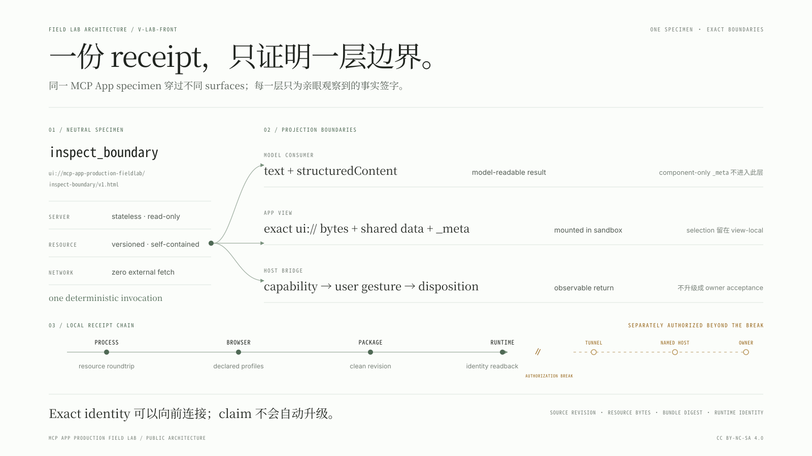
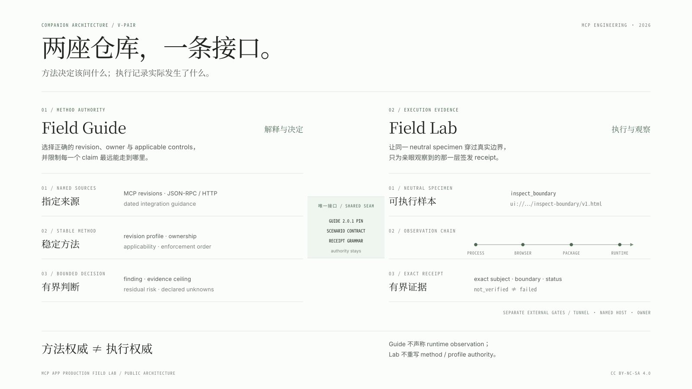
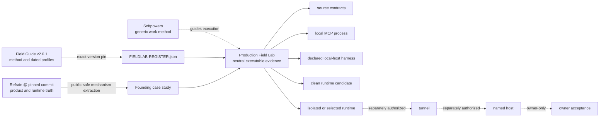
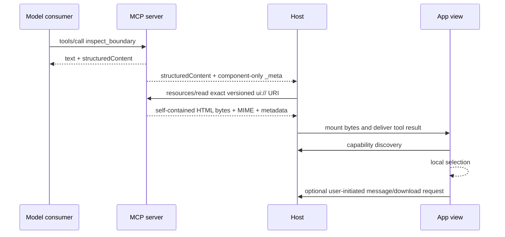

<!-- docs-pair: architecture; locale: zh-CN; mirror: docs/ARCHITECTURE.en.md -->

# Architecture

[English](./ARCHITECTURE.en.md)

MCP App Production Field Lab 的核心不是再造一套 framework，而是把 authority、execution surface 与 evidence ceiling 固定在同一张图里。Neutral specimen 足够真实，可以经过 MCP resource、App bridge、browser sandbox 与 package/runtime paths；又足够小，不会把 Refrain 产品逻辑搬进来。方法权威仍是 MCP Server Engineering Field Guide `2.0.1`。



## Authority topology





这些箭头不转移 authority：

- Field Guide 拥有 method/profile interpretation；Lab 只拥有针对 exact selected profile set 的 executions。
- Softpowers 拥有通用 implementation/debug/verification workflow；Lab 提供 MCP App-specific seams 与 receipts。
- Refrain 拥有其 source、renderer、deployment、runtime 与 acceptance truth；case study 只抽取 mechanisms。
- Local harness 只拥有其 declared observable envelope，不能替 ChatGPT 或其他 named host、host account policy、discovery cache 与 undocumented behavior 发言。

## Dual-consumer specimen

一次 `inspect_boundary` invocation 同时服务两个 consumers，但不合并数据边界：



Server 是 stateless、read-only。Selection state 留在 view。Capability discovery 开始时是 `pending`；只有完成后才会成为 `available`、`missing` 或失败状态。Optional host action 只在 capability available 后出现；in-flight request 禁止重复触发并暴露 busy state。Bridge return 只按实际 contract 记录 request disposition，不能升级为 owner acceptance，也不能凭空推断 host cause。

## Exact resource boundary

Production resource authority 是一个 explicit-version URI：

```text
ui://mcp-app-production-fieldlab/inspect-boundary/v1.html
```

Production builder 产生 JS/CSS artifacts。`src/self-contained-view.ts` 从 exact manifest entry 读取 closure，拒绝 static `imports`、`dynamicImports`、额外 chunk dependency 与 unsafe absolute/traversal path，转义 closing tags，并组装单一 HTML document，内联 style 与 module script。MCP server 以 `text/html;profile=mcp-app` 和 zero-domain CSP 注册、服务这些 exact bytes。

这个 contract 必须存在，因为 MCP JSON-RPC/resource delivery 与 iframe asset GET 是不同 planes。Resource 可以被发现，而 external scripts、styles、fonts 或 media 仍可能不可达。因此 local MCP smoke 必须执行 `resources/read`，browser harness 必须挂载读回的 bytes；unexpected network 是 contract violation 的 evidence。

## Version 与 identity graph

Server metadata 与 runtime candidate 读取 packaged `package.json` 中的 version authority，并由 register validator 约束它与 `FIELDLAB-REGISTER.json` 一致。Lab 不用一个 hash 冒充所有 identity：

| Identity                       | 回答的问题                                                      |
| ------------------------------ | --------------------------------------------------------------- |
| package/register version       | 哪一个未发布的 Field Lab contract version 被声明？              |
| `source_revision`              | 选择了哪一个 exact committed source tree？                      |
| resource URI                   | 请求了哪一个 versioned MCP App document name？                  |
| resource `sha256` + byte count | 实际读回并挂载了哪一组 HTML bytes？                             |
| per-file SHA-256               | Runtime candidate 包含哪些 exact files？                        |
| `bundle_digest`                | 哪一个 sorted candidate payload identity 被打包？               |
| runtime health identity        | 当前 process 报告自己服务哪一个 source revision/bundle？        |
| image/service identity         | 如果存在 deployment，operator 选择了哪一个 immutable artifact？ |

Resource content identity 不是 source identity；package identity 不是 activated-runtime identity。Health response 只有从正在提供被测 MCP endpoint 的同一 origin/process 读回时才有意义。

## Evidence policy 与 receipt model

`src/evidence/policy.ts` 是 boundary、exercise surface、environment class、method rung、authorization/runner 与 subject-identity requirements 的单一 declarative authority。`validateScenarioSet` 检查 exact `id@revision` uniqueness、prerequisite existence、acyclic graph、ceiling monotonicity 与 legal runner combinations。`parseReceiptAgainstScenario` 在 structural schema 之外，将 receipt 与 exact scenario 交叉验证，防止 environment、rung、status 或 subject identity 越权。

Scenario contracts 位于 `scenarios/`；receipt structural authority 位于 `src/evidence/receipt.ts` 及其 generated JSON Schema。每份 receipt 记录：

- exact scenario id/revision 与 claim text；
- `verified`、`failed` 或 `not_verified`；
- 一个 `method_rung` 与 explicit `proof_ceiling`；
- 实际用于判断的 subject identities；
- environment/profile，以及独立建模的 capability discovery/disposition；
- 可选的 `confirmed`、`probable` 或 `unknown` root-cause confidence；
- observations、evidence references、limitations 与非空 `not_proven`。

Attempted `verified` / `failed` receipt 必须带实际 observations 与 evidence refs，并按 rung 带 resource/artifact/runtime identity。`verified` 还必须让 `method_rung` 精确达到 scenario 声明的 claim rung（当前由其 `proof_ceiling` 表达）；低于该 rung 的 observation 不能被写成 verified exact claim。`not_verified` 必须带 exact `not_verified_reason`，但不得为了通过 schema 伪造尚未产生的 external identity。Capability available 与 request rejected 可以和 verified process observation 同时成立；它们不是同一个维度。

## Local receipt chain

Ordinary local verification 形成一条 live、但仍然 local-only 的 four-receipt chain：

1. `npm run check` 最终执行 `test:mcp`，写入 `tmp/receipts/mcp-resource-roundtrip.json`。
2. `npm run test:host` 通过 `scripts/run-host-evidence.ts` 启动 Playwright JSON reporter。Runner 只接受 exact five-test closure：五个 required titles/results 全部各通过一次，zero skipped/unexpected/flaky/report errors；只有完整 attestation 与 resource prerequisite set 都验证成功后，才写入 `tmp/receipts/mcp-host-profile-matrix.json`。不存在脱离该 evidence runner 的 standalone successful writer path。
3. `npm run package:runtime` 要求前两份 receipt 都来自同一个 clean committed revision，使用 staged candidate 内自己的 full `scenarios/` set 与 compiled validators 验证 prerequisite receipt set，再原子采用 candidate 并写入 `tmp/receipts/package.clean-revision@1.json`。
4. `npm run smoke:runtime` 读取 resource、host 与 package receipts，从 candidate runtime 自己的 `scenarios/` 与 compiled policy 验证加入 runtime receipt 后的 four-receipt chain；只有 child 已成功停止、temporary runtime projection 已成功清理后，才持久化 `tmp/receipts/runtime.isolated-readback@1.json`。

对每份 attempted dependent receipt，validator 收集完整 transitive prerequisite closure，要求其中每份 receipt 存在且为 `verified`，再把每一个 ancestor 与 dependent 比较。Join fields 是 `source_revision`、exact `resource`、`bundle_digest`、`runtime_identity`；某个 ancestor/dependent pair 只比较双方都实际携带的字段。Exact resource 是 URI、MIME、bytes 与 SHA-256 的整体 identity；每份携带 resource 的 attempted receipt 还必须包含 `resource:sha256:<subject.resource.sha256>` evidence ref。当前 graph 因而让 package 与 resource/host ancestors 比较 clean source revision；runtime 则不仅与 package 比较 source revision + bundle digest，还与 transitive resource/host ancestors 比较 source revision + exact resource。即使 package receipt 不携带 resource，runtime resource 仍会被前两份 process receipts 约束。

这些 receipts、candidate、browser traces 与 screenshots 都在 ignored/local-only paths。Public CI 的 `clean-package-runtime` job 必须在同一个 clean checkout/job 中重跑 `npm run check` 与 `npm run test:host`，再 package/smoke；raw receipts 不上传，也不在 jobs/runs 之间共享。

## Local host harness

Harness 使用 MCP Apps bridge 与真实 iframe lifecycle，覆盖三个 explicit profiles：

- `restricted`：sandbox only；message/download capability 缺失。
- `capability-success`：message 与 download advertised，并返回成功。
- `capability-rejected`：同样 advertises capabilities；download 被明确 rejected，message 只按 bridge 能观察到的 returned/failed 记录。

Ledger 记录 resource URI/MIME/bytes、initialization sequence、protocol requests、capability pending-to-terminal transition、request disposition、console/page errors 与 unexpected network。它按 contract 设置 `namedHostSimulation: false`。320px/390px viewport 与 keyboard checks 保护 identity、fallback 与 actions 不被截断。绿色 local harness 仍只证明 exact App 在这些 declared envelopes 下的行为；它不证明 ChatGPT admission、cache refresh、workspace policy、tunnel state 或 owner acceptance。

Host receipt 不从“Playwright process exit 0”直接推导。`run-host-evidence.ts` 消费 exact JSON report closure，要求 `expected=5`、`skipped=0`、`unexpected=0`、`flaky=0`、report `errors=[]`，并逐一匹配五个 canonical test titles、expected/pass status 与单一 passed result；任一额外、缺失、duplicate、skipped、flaky 或 unexpected result 都阻止 receipt emission。

## Package 与 activation boundary

Package lane 有意晚于 source/process tests：

1. 在 clean committed checkout 上生成 resource 与 host prerequisite receipts。
2. 拒绝 dirty source 与 already-existing output path，并解析该 committed revision。
3. 在 detached clean worktree 中用 pinned lockfile build。
4. 物化 runtime-only candidate、full scenario authority、完整 layered license boundary 与 sorted per-file identities。
5. 对 candidate-owned scenario set 与 prerequisite receipt set 做 semantic validation，生成 package receipt，再记录 `release.json` 并原子采用 candidate path。
6. 把 candidate 复制进 isolated temporary projection，安装 production dependencies，启动 fresh loopback process，将 `/healthz` identity 与 MCP discovery/tool/resource readback 对照，并验证 four-receipt chain；runtime receipt 只有在 child stop 与 temporary projection cleanup 都成功后才写入。

该 isolated process 可以证明 candidate 执行并一致地 self-report。它不能证明 operator 已安装或选择它作为 production，更不能证明 tunnel 或 named host 可以到达它。

## Documentation 与 public CI witness

`DOCS-REGISTER.json` 登记中文默认与 English mirror pairs、reciprocal switches 以及必须同步的 shared facts；`scripts/validate-docs.mjs` 只检查 structure 与 registered facts，不声称证明 prose 的 semantic equivalence。`LICENSE` 与 `LICENSE-DOCUMENTATION.md` 保持 governing singletons；`LICENSING.md` 是 governing English path map，中文版本只供阅读便利。

`.github/workflows/verify.yml` 是 credential-free、read-only 的 public witness source。它可以重放 source/process、browser-host、clean-package 与 isolated-runtime lanes，但 workflow 文件存在不等于 remote run 已完成；在 GitHub Actions 真正执行前，remote CI execution 仍为 `not_verified`。

`docs/architecture/` 中的两组 bilingual native SVG 是 README / architecture front doors。SVG 本身同时是 editable source 与 publication artifact；它们必须保持 self-contained，不得包含 script、`foreignObject`、external font / image / stylesheet 或 remote fetch。中英 siblings 共享 geometry、stable group IDs 与 boundary semantics，但各自拥有自然语言 copy。修改语义时必须同步两个 language files，并在 browser 的 1600×900 与 README-width 两种尺度实际检查；XML 合法不能替代 legibility review。

## Trust 与 side-effect boundaries

Ordinary local actions 包括 source inspection、build/test、bundled Chromium execution、ignored receipt generation、clean candidate packaging 与 isolated loopback smoke。以下仍是独立 gates：

- credential/profile access 与 tunnel preflight；
- 启动或重启 tunnel/service；
- 选择或部署 immutable runtime；
- authenticated named-host discovery/interaction；
- 记录 owner acceptance；
- remote/visibility change、GitHub/package release publication、license change 与 separate commercial permission。

Credentials、cookies、private URLs、private conversations/logs 与 raw owner evidence 永不进入 Git。Exact claim ceilings 见 [Testing](TESTING.md) 与 [tunnel/named-host runbook](runbooks/tunnel-and-named-host.md)。
